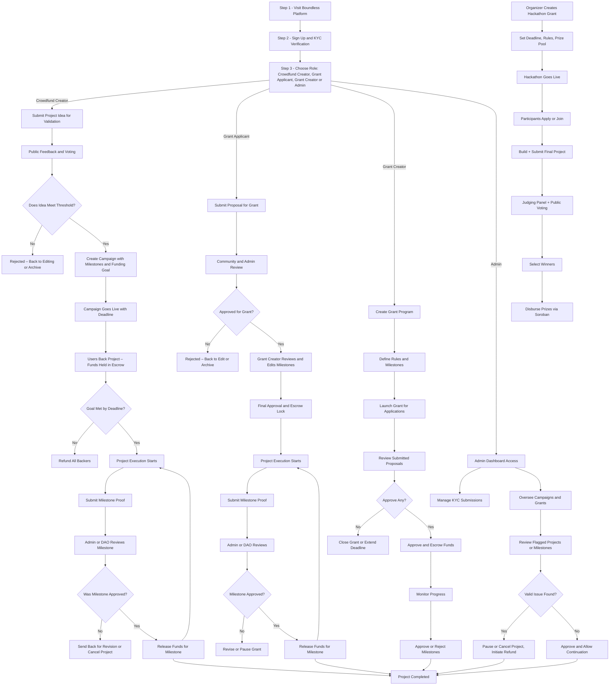

# Boundless

Boundless is a decentralized crowdfunding and grants platform built on the Stellar blockchain that empowers creators, innovators, and communities to launch and fund projects in a transparent and secure manner. Leveraging Soroban smart contracts, the platform facilitates milestone-based fund releases with built-in escrow mechanisms, ensuring that funds are only released when specific project milestones are met and independently verified. This approach minimizes risks for backers and provides creators with the financial support they need to drive innovation forward.

## Key Features

- **Decentralized crowdfunding and grant management** on the Stellar blockchain
- **Milestone-based fund distribution** using escrow and smart contracts
- **Secure and transparent community voting and feedback systems**
- **Flexible user roles** including campaign creators, grant applicants, managers, and admins
- **Integrated authentication** with email, social login, and KYC verification
- **Comprehensive backend support** with RESTful API endpoints and robust security measures
- **Automated contract deployment and upgrade processes** using CI/CD pipelines

## Technical Details

- **Smart Contracts:** Rust (Soroban SDK)
- **Frontend:** TypeScript, Next.js, Tailwind CSS, Zustand
- **Backend:** Node.js, RESTful APIs, Prisma ORM, PostgreSQL
- **Blockchain Integration:** Stellar SDK, Soroban smart contracts
- **DevOps:** GitHub Actions, Vercel, Docker

## User Flow



## Getting Started

### Prerequisites
- Node.js (v18+)
- npm or yarn
- Docker (for local blockchain and database)

### Installation

1. **Clone the repository:**
   ```bash
   git clone https://github.com/boundlessfi/boundless-frontend.git
   cd boundless-frontend
   ```
2. **Install dependencies:**
   ```bash
   npm install
   # or
   yarn install
   ```
3. **Configure environment variables:**
   - Copy `.env.example` to `.env` and fill in required values.

4. **Run local development server:**
   ```bash
   npm run dev
   # or
   yarn dev
   ```

5. **Run tests:**
   ```bash
   npm test
   # or
   yarn test
   ```

6. **Build for production:**
   ```bash
   npm run build
   # or
   yarn build
   ```

## Contributing

Contributions are welcome! Please open issues and submit pull requests for new features, bug fixes, or improvements. See [CONTRIBUTING.md](CONTRIBUTING.md) for guidelines.

## License

This project is licensed under the MIT License. See [LICENSE](LICENSE) for details.

## Acknowledgements

- Stellar Development Foundation
- Soroban SDK
- Next.js, Tailwind CSS, Zustand
- MongoDB
- Docker, Vercel, GitHub Actions
